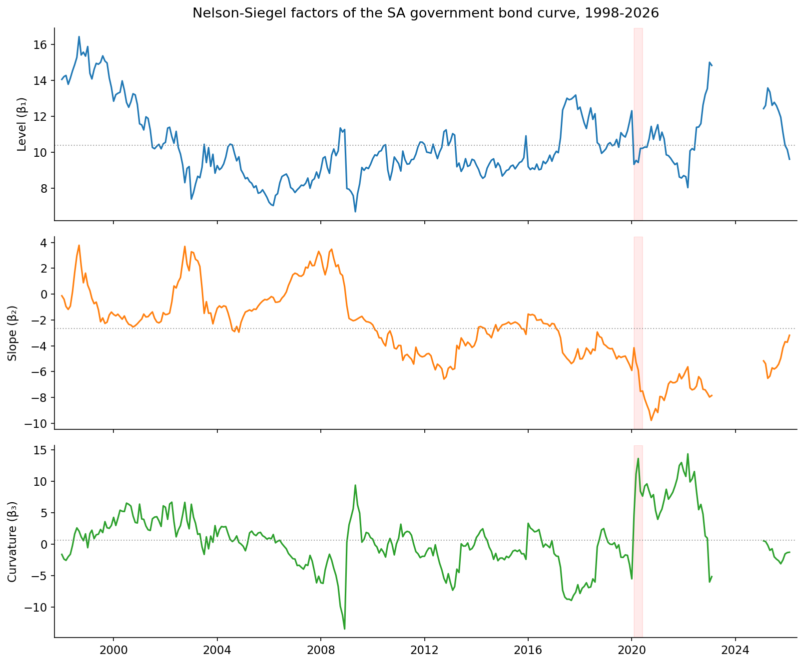
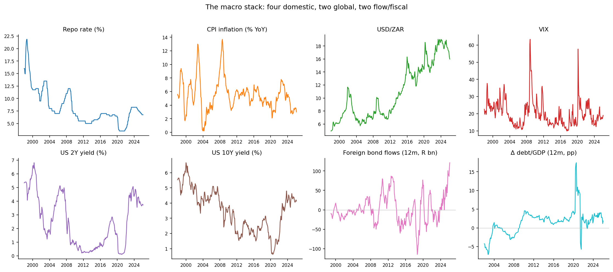
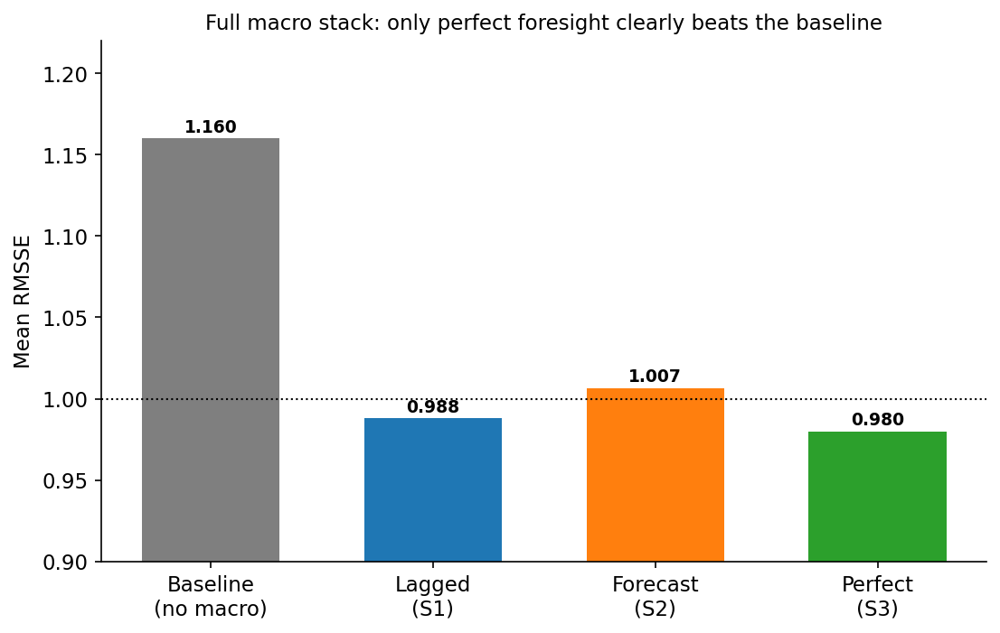
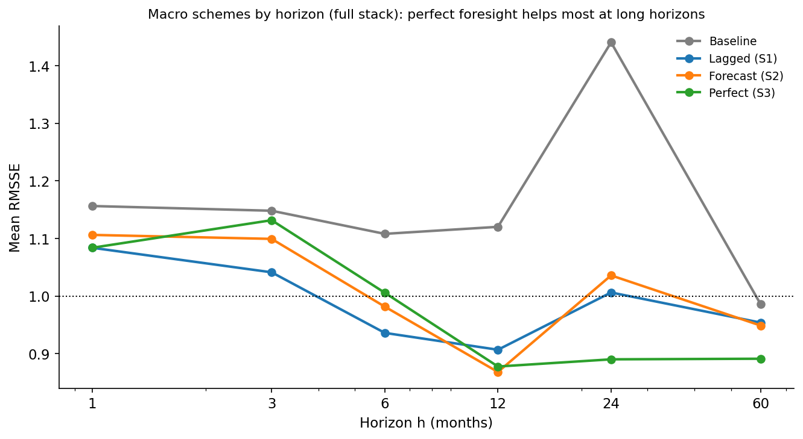
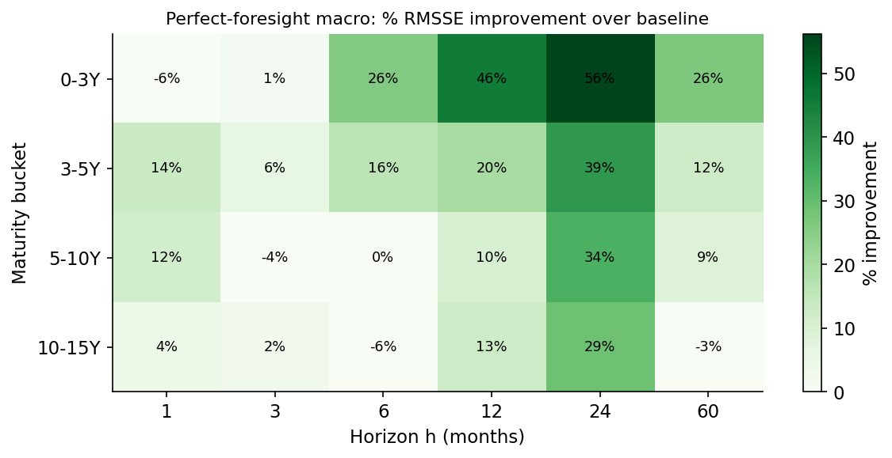
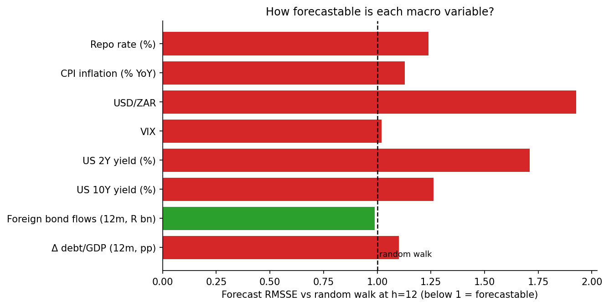
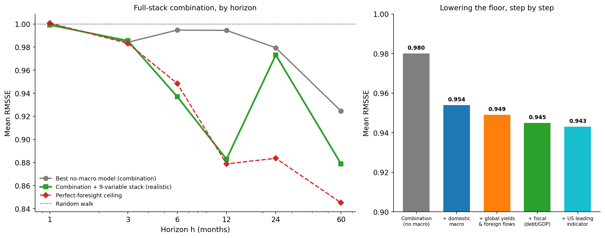

  ℹ️
  

    
Disclaimer

    
Nothing in this post is financial advice. It is a methodological investigation of forecast accuracy on historical data.

  

{{< summary   trader="The first post found that the humble random walk is nearly impossible to beat for South African bond yields. Here I ask whether macro data can do better - and the answer is yes, but only with the right ingredients used the right way. The four obvious domestic variables (inflation, the repo rate, the rand, the VIX) barely help: the local curve has already priced them in, and a macro-augmented model on its own is still worse than a coin flip. The real gains came from looking outside South Africa's borders - US Treasury yields, foreign bond flows, and the pace of government debt - and from averaging that macro-aware forecast against the best yield-history model only at the horizons where macro moves. That combination lands at the most accurate forecast across both posts. The macro never makes one model prophetic; it helps by being differently wrong, and by carrying global and fiscal information the domestic view was blind to. A later, wider hunt for more variables turned up just one small addition and otherwise confirmed the local curve had already priced the rest."   loremaster="A macro augmentation of SA government bond yield forecasts (four SARB maturity buckets, six horizons) under three schemes: lagged (S1), forecast-the-macro (S2), and perfect foresight (S3), where S2 and S3 share a model trained on contemporaneous macro and differ only at prediction. The macro stack is eight variables: four domestic (repo, headline CPI, USD/ZAR, VIX), two global (US 2Y and 10Y Treasury yields), and two flow/fiscal (12-month cumulative non-resident bond purchases, KBP2051; 12-month change in government-debt-to-GDP from KBP2900 and nominal GDP KBP6006L). A ninth variable, the SARB leading indicator for the United States (KBP7093B, year-on-year), was added on a later external sweep. Findings: (i) perfect-foresight macro cuts LightGBM RMSSE ~16% (1.16 to 0.98) and dips below the first post's best model, concentrated at h>=12; (ii) realistic macro fed into one model is worse than a random walk - the variables are near-unforecastable, the rand and US 2Y worst; (iii) the gains come only through combination: blending a conservatively-forecast macro model into the AFNS-RW+AR(1) combination, horizon-aware (h>=6), reaches 0.945 on the eight-variable stack (0.943 with the US leading indicator added) over the 2006-2026 common window versus 0.980 for the no-macro combination; (iv) the decisive additions were global yields and foreign flows, which lower both the realistic floor and the perfect-foresight ceiling; debt-to-GDP lowers the floor but raises the ceiling, an honest caveat. A wide comparison shows perfect macro helps weak ML models ~12% and strong models ~0%, and no single augmented model beats the combination. Directional accuracy: perfect macro lifts all models to 0.60-0.68, realistic helps 2/8, the combination 0.577 to 0.587. Tooling: Python (scikit-learn, LightGBM, statsmodels).">}}

## Where the first post left off

The [first post](https://overfitandchill.co.za/posts/fc-yields/) was a long horse race between roughly twenty ways of forecasting the South African government bond curve, and it ended on a humbling note: on this near-unit-root, small-sample data, almost nothing beats a random walk per factor, and the only modification that reliably helps is *combining* a couple of simple models. Sophistication, repeatedly, was not the same thing as accuracy.

That post deliberately used no information beyond the yields' own history. The obvious objection - the one any macroeconomist would raise within about four seconds - is that bond yields are supposed to be *about* something. They embed expectations of inflation, of the policy rate, of the currency, of global risk appetite. Surely feeding the models those variables would help.

This post tests that objection as fairly as I can. It also does the thing I should have done in the first post and look at the factors themselves before asking anyone to forecast them.

## The factors: level, slope, curvature

The whole approach rests on compressing the four-point curve into three Nelson-Siegel factors - a level, a slope, and a curvature - and forecasting those. Before we ask whether macro data helps predict them, it is worth seeing what they actually do.

Yes the graphs have a gap. This is due to the The 3-5Y yield series (`KBP2001M`) that has **23 consecutive months of missing data**. The cause is documented on SARB's [Current Market
Rates page, footnote 6](https://www.resbank.co.za/en/home/what-we-do/statistics/key-statistics/current-market-rates).

<figure>

<figcaption aria-hidden="true">The three Nelson-Siegel factors of the SA government bond curve, 1998-2026. Dotted line is each factor’s mean; the red band marks the COVID shock of early 2020.</figcaption>
</figure>

Three observations, each of which matters for what follows.

The **level** is the slow giant. It drifts between roughly 7% and 16% over the sample, with a standard deviation of about 2 percentage points and a first-order autocorrelation of 0.955 - extremely persistent, very nearly a random walk. It is the long-run anchor of the whole curve, and it moves like a glacier. This is precisely why, in the first post, anything that imposed mean-reversion on it (AR(1), the Kalman AFNS) was punished: there is no stable mean for it to revert *to* on this sample.

The **slope** is the most persistent factor of all, with an autocorrelation of 0.981. It captures the gap between the short and long ends of the curve, and it swings from deeply negative (a steep, upward-sloping curve, short rates far below long) to mildly positive (a flat or inverted curve) as the monetary cycle turns. If macro information lives anywhere in this curve, it lives here - more on that in a moment.

The **curvature** is the troublemaker. It has by far the largest standard deviation (4.4, more than twice the level's) and the lowest persistence (autocorrelation 0.916). It is the medium-term hump of the curve, and it is mostly noise: it jumps around with auction technicals, liquidity, and the occasional convulsion like the COVID spike clearly visible in early 2020. It is the hardest of the three to forecast and, mercifully, the least important for the overall curve.

The punchline, which the macro section will lean on, is hiding in the correlations between these factors and the macro variables:

| Factor    | Repo rate | CPI inflation |  USD/ZAR  |  VIX  |
|:----------|:---------:|:-------------:|:---------:|:-----:|
| Level     |   +0.48   |     −0.02     |   +0.07   | +0.16 |
| **Slope** | **+0.72** |   **+0.48**   | **−0.63** | +0.12 |
| Curvature |   −0.06   |     −0.10     |   +0.16   | +0.27 |

The slope is where the economics is. It is strongly tied to the repo rate (+0.72), to inflation (+0.48), and inversely to the rand (−0.63): when the Reserve Bank hikes, when inflation runs hot, and when the currency is strong, the curve flattens. The level has a moderate link to the policy rate and is otherwise its own slow creature; the curvature is essentially uncorrelated with the macro economy and faintly tracks global volatility. So *if* macro variables are going to help, the mechanism is clear - they should help most with the slope, and therefore most at the horizons and buckets where the slope dominates.

## The macro variables

In my first attempt I started with four variables - the canonical *domestic* drivers of a yield curve. They turned out to be only part of the story. An *emerging-market* bond, and an EM long-yield is, to a first approximation, the US Treasury yield plus a risk premium that foreign investors demand and the fiscal trajectory shapes. So the full stack used here is **eight** variables in three groups, every one sourced with full coverage from the SARB Quarterly Bulletin (plus the VIX and US Treasury yields):

<figure>

<figcaption aria-hidden="true">The eight-variable macro stack: four domestic drivers, two global rates, and two flow/fiscal series. The red band marks the COVID shock.</figcaption>
</figure>

- **Domestic (four):** the **repo rate**, the Reserve Bank's policy lever; **CPI inflation**, the target it steers, mostly inside the 3-6% band with a sharp 2021-23 surge and a recent collapse to around 3%; the **rand**, the relentless one-way drift to the high teens against the dollar; and the **VIX**, the global fear gauge.
- **Global (two):** the **US 2-year and 10-year Treasury yields** - the world price of duration, which an emerging-market curve cannot escape.
- **Flow and fiscal (two):** the **twelve-month cumulative net non-resident purchases of SA bonds** (when foreigners head for the exit, the long end reprices hard), and the **twelve-month change in government debt-to-GDP**, the pace of fiscal deterioration that shapes the term premium.

These are levels and one-step-ahead realities. The entire question of this post is what happens when you try to use them to predict the future of the curve - and the answer turns on a distinction that is easy to gloss over: *which* value of the macro do you actually get to use?

## Three ways to use a macro variable

Suppose you are standing at month $t$ and want to forecast a yield $h$ months ahead, at $t+h$. You want to use inflation as a predictor. Fine - but inflation *when*? There are three honest answers, and they are wildly different in both realism and power.

**Scheme 1 - lagged (carry-forward).** Use the last inflation reading you actually have at time $t$, and freeze it. This is the only fully honest, fully implementable scheme: it uses no information you do not possess at the moment of forecasting. It is also the weakest, because a single frozen snapshot tells you little about where the curve will be five years out.

**Scheme 2 - forecast the macro too.** If you want inflation *at* $t+h$, then forecast it, using the same kind of model you are using for the yields. If the yield model is a LightGBM, forecast inflation with a LightGBM. This is the realistic "do it properly" scheme: you build a genuine macro forecast and feed it in. It is implementable, but it inherits all the error of the macro forecast.

**Scheme 3 - perfect foresight.** Pretend you can forecast the macro without error - reach into the future, read off the actual realised value at $t+h$, and feed that in. This is impossible, cheating, and the single most informative thing you can compute. It is the *ceiling*: the best the macro could ever do for you, if only you could see it coming. The gap between Scheme 3 and Scheme 2 is, precisely, the price of not being a prophet. But the ceiling is really useful and one I wish more economic forecasting papers would consider showing. It helps explain where the error in our forecasting lies - the macro, the forecast variable or the model.

Schemes 2 and 3 share the same underlying model - both are trained on the contemporaneous relationship between the macro at the target date and the yield at the target date - and differ *only* in what they are fed at prediction time: Scheme 3 gets the truth, Scheme 2 gets the forecast. This isolates the cost of macro forecast error cleanly. Everything below is leakage-free walk-forward, on the same four buckets and six horizons as the first post, for two model classes (a linear Ridge and a LightGBM).

## The result

<figure>

<figcaption aria-hidden="true">Mean RMSSE by macro-inclusion scheme for the LightGBM model on the full eight-variable stack. RMSSE below 1 (dotted line) beats the naive random walk. Only perfect foresight (green) clears the bar comfortably; the realistic schemes hover at the random walk.</figcaption>
</figure>

The headline numbers for the LightGBM model on the full stack, averaged across all 24 bucket-horizon cells:

| Scheme                    | LightGBM (full stack) |
|:--------------------------|:---------------------:|
| No macro (baseline)       |         1.160         |
| S1: lagged                |         0.988         |
| S2: forecast macro        |         1.007         |
| **S3: perfect foresight** |       **0.980**       |

Read that table slowly, because it is the whole post.

**Perfect foresight helps a lot.** Knowing the macro future cuts mean RMSSE by roughly 16%, from 1.16 to 0.98. More striking: at 0.98, the perfect-foresight model dips *below the best model from the entire first post* - the half-AFNS-RW-plus-half-AR(1) combination at 0.99. After twenty model classes failed to beat the random walk by any meaningful margin, the one thing that does is a peek at next year's macro prints. The macro information is genuinely valuable.

**The realistic schemes capture almost none of it.** Lagged macro (S1) lands at 0.988 - it just barely beats the random walk by telling the model what the curve has mostly already priced. Forecasting the macro (S2) is actually worse at 1.007: feeding eight noisy macro forecasts into the model injects more error than signal. Neither comes within shouting distance of the perfect-foresight ceiling. The value is real, and as a direct input it is almost entirely out of reach.

Where does the perfect-foresight gain come from? Almost entirely from the long horizons:

<figure>

<figcaption aria-hidden="true">Mean RMSSE by horizon for each scheme. The perfect-foresight line (green) pulls away from the others at h=12 and beyond, exactly where the slow-moving slope and level factors - the ones tied to the macro - dominate the forecast.</figcaption>
</figure>

At one and three months, even perfect foresight barely helps: the near-term curve is pinned by its own current level, and the macro adds little. From a year out, the gap opens dramatically. Perfect-foresight LightGBM is essentially neutral at h=1 but falls to around 0.88 at h=12 and below that at the longest horizons. This is exactly the pattern the factor correlations predicted: the macro lives in the slope, the slope is the slow, persistent factor, and slow persistent factors only really *matter* for the forecast once the horizon is long enough for them to have moved.

<figure>

<figcaption aria-hidden="true">Per-cell reduction in RMSSE from perfect-foresight macro, versus the no-macro baseline, in percent. Green is improvement. The gains cluster unmistakably in the long-horizon (h=12, 24, 60) columns.</figcaption>
</figure>

## Why you can't have the ceiling

The gap between Scheme 3 (perfect) and Scheme 2 (forecast) is the price of forecasting the macro. To see why it is so steep, just try to forecast the macro and see how you do:

<figure>

<figcaption aria-hidden="true">How hard is each macro variable to forecast? RMSSE of an h-step forecast against a random walk. Values at or above 1.0 mean the model is no better - or worse - than simply assuming the macro stays where it is.</figcaption>
</figure>

This is the saddest chart in the post, and the most important. Almost every macro variable sits at or above the 1.0 line - meaning a serious forecasting model cannot reliably beat the assumption that the variable just stays put. The rand is the worst offender by far (no surprises there) with forecast errors nearly twice a random walk's; the US 2-year is barely better. Inflation, the repo rate, US 10-year and the debt-to-GDP change are all modestly worse than a random walk. The lone exception is the cumulative foreign-flow series, which is just forecastable (0.99) because it is a slow-moving twelve-month sum. But broadly, the macro stack is about as hard to forecast as the yields themselves.

That is the trap, stated plainly. The macro carries real information about the future curve - Scheme 3 proves it. But to use that information you need the macro's *future* value, and forecasting the macro's future is a problem every bit as hard as the one you started with. You have not escaped the difficulty; you have merely moved it next door. Feeding a noisy macro forecast into the yield model (Scheme 2) mostly just injects the macro's forecast error into the yields, which is why it barely helps and sometimes hurts.

## Can we do better? Yes - but not the way you'd think

Everything above measured macro against a deliberately weak yardstick: a lag-only machine-learning model that, like most of the ML models in the first post, is itself worse than a random walk. So "macro helps" has really meant "macro makes a bad model less bad." Three changes turn that into a genuine improvement, and every one of them is a lesson the first post already taught.

**First, forecast the macro conservatively.** The natural instinct is to forecast the macro with the same tool as the yields - LightGBM yields, LightGBM macro. That is exactly wrong. Because the macro variables are near-unforecastable, a flexible forecaster overfits their noise and pipes it straight into the yield forecast. Swapping in a heavily-regularised Ridge - or simply carrying the macro forward - drops the realistic macro-augmented error from 1.14 to 1.04. The macro forecast wants maximum parsimony, the same as everything else on this data.

**Second, and this is the heart of it, combine the macro signal with the *best* model rather than the weak one.** A macro-augmented model, forecast honestly, scores about 1.04 - worse than a coin-flip random walk and well short of the first post's best model, the AFNS-RW + AR(1) combination at 0.989. On its own it is useless. But its errors are only about 0.83-correlated with the combination's errors, and that gap is pure gold to a forecast combination. Averaging the two captures the diversification even though one of the ingredients is, by itself, bad.

**Third, do that combination only where macro actually matters.** Macro is noise at the one- and three-month horizons, where the curve is pinned by its own current level, and signal at the longer horizons, where the slow, macro-linked slope has time to move. Blending the macro forecast in only at six months and beyond avoids the short-horizon penalty entirely.

Put together, these three steps pull the *domestic* macro stack into the combination at a mean RMSSE of about 0.954 - already past the no-macro combination. But the larger gain came from a different question: not *how* to use the macro, but *which* macro. The four domestic variables describe South Africa; they say nothing about the world an emerging-market curve actually floats in. Three additions, each passing the same test, lower the floor further:

- **Global rates.** Adding the US 2-year and 10-year Treasury yields drops the combination to **0.949** - and, crucially, it also lowers the *perfect-foresight ceiling* (to 0.91 from 0.93). That second fact is the tell that the gain is real rather than lucky: US yields explain genuinely new variance in the SA curve, through the global-duration channel the domestic variables miss.
- **Foreign flows.** The twelve-month cumulative non-resident bond position helps specifically at the long-maturity, long-horizon end, exactly where the term premium it drives lives.
- **Fiscal momentum.** The twelve-month change in debt-to-GDP takes the realistic combination to **0.945**. (Honesty compels a caveat: unlike the global and flow variables, debt-to-GDP lowers the realistic number but *raises* the perfect-foresight ceiling - the signature of a gain that may be partly sample-specific rather than structural. It earns its place on the realistic metric, but with an asterisk.)

Fortunately or unfortunately - depending who you ask - I have trouble accepting analytical outcomes as they are. I wider search for useful variables turned up another that deserves to be documented. The SARB publishes a **leading indicator for the United States**, a gauge of the global activity cycle an emerging-market curve is exposed to. Almost alone among the dozen external candidates tried (catalogued below), it lowers *both* the realistic floor - to **0.943** - and the perfect-foresight ceiling, the signature of genuine signal rather than luck. The gain is small, roughly a quarter of a percent, but it is real, and like everything else that worked here it points outward, beyond South Africa's borders. It joins as the ninth and final member of the stack.

<figure>

<figcaption aria-hidden="true">The full-stack combination. Left: by horizon, the combination plus the nine-variable macro stack beats the no-macro combination everywhere from six months out, with the perfect-foresight ceiling below it. Right: lowering the floor step by step - from the no-macro combination, through domestic macro, global yields and foreign flows, and the fiscal variable, to the US leading indicator - to a mean RMSSE of 0.943.</figcaption>
</figure>

Put together - conservative macro forecasting, combination with the best model, horizon-aware blending, and the right *external* variables - this produces a mean RMSSE of **0.943, the most accurate realistic forecast in either post** - 0.945 on the eight-variable stack, edging to 0.943 once the US leading indicator joins as a ninth - against 0.980 for the no-macro combination and 1.000 for the random walk on the same 2006-2026 window. The macro information finally pays off. But notice *how*: not by making any single model see the future more clearly - a macro-augmented model on its own is still worse than a random walk - but by handing a combination forecasts that are wrong in different directions, built from the global and fiscal forces a domestic-only view was blind to. The contribution is diversification plus the right information set, never prescience.

### Where the macro earns its keep

Just as in the first post, the aggregate numbers hide a lot of structure. Here is the full scoreboard - the realistic, macro-augmented version of every model, scored cell by cell against the random walk, exactly as the first post laid out its model zoo.

<figure>

<figcaption aria-hidden="true">RMSSE per cell for the macro-augmented (realistically-forecast) version of all nine models, faceted by horizon. Green beats the random walk, red is worse. The pattern is stark: at one and three months almost everything is red - feeding forecasted macro into a single model at short horizons just injects noise. Green appears only from six months out, and it is LightGBM and the simple models (AR(1), DNS-RW, the combination) that turn green, while the flexible linear models stay red at the long end.</figcaption>
</figure>

Read across the horizons and the slope story falls out of the colours. The short-horizon panels are a sea of red: no model's realistic macro version reliably beats the random walk when the curve is pinned by its own current level. From six months the greens emerge, concentrated in LightGBM and the strong baselines, and by five years the better models are firmly green at the short and medium maturities. This is the same lesson as the headline, drawn cell by cell: realistic macro, fed into one model, is a long-horizon tool at best - and even then it rarely beats the random walk on its own. The value only materialises once these forecasts are *combined*.

The same scoreboard in directional terms - does the macro-augmented model at least call the *direction* of the move right? - is more forgiving.

<figure>

<figcaption aria-hidden="true">Directional accuracy per cell for the macro-augmented version of all nine models, faceted by horizon. Green beats a coin flip (0.5), red is worse. The short horizons hover around a coin flip, but patches of strong green appear from twelve months out - and at five years the short and medium maturities are calling direction correctly 60-80% of the time, even in cells where the magnitude error was red. The exception is the longest maturities at the five-year horizon, which are red on both metrics: the place where the macro forecast itself falls apart.</figcaption>
</figure>

Direction is kinder to macro than magnitude. In several long-horizon cells the macro tells you which *way* the curve will lean even when it cannot tell you how far - the short-maturity, five-year cells reach into the 0.7-0.8 range. But the same long-end cells that were red on RMSSE are red here too: when the macro forecast breaks down at the very long end, it takes both magnitude and direction with it. As with everything else in this post, the directional edge is real, modest, and concentrated exactly where the combination does its work.

Which raises the first post's favourite question: if the scoreboard is the league table, which model actually *wins* each cell? Now that the macro-augmented combination is in the running, the map is redrawn.

<figure>

<figcaption aria-hidden="true">The best approach for each maturity bucket and horizon, with its achieved RMSSE, coloured by family. At the shortest horizons the simple yield-history models - AR(1) and the DNS random walk - are unbeatable, because macro adds nothing there. From six months out the macro-augmented combination takes over the entire middle of the grid. Five families still share the 24 cells, but the combination-plus-macro now owns the most of them - the first time in either post that a macro-aware model has won cells outright.</figcaption>
</figure>

The picture is honestly heterogeneous - five families split the 24 cells. AR(1) and the DNS random walk own the one- and three-month columns, where the curve is a martingale and macro is pure noise. The macro-augmented combination takes ten cells, all of them at six months and beyond, right across the maturity spectrum - exactly where a real-money investor actually sets duration. And at the very long end the no-macro models reclaim a few cells (5-10Y and 10-15Y at five years), the same place the macro forecast finally falls apart. No single approach wins everywhere; but for the first time, the macro-aware one wins the part of the grid that matters most.

### Why a better macro forecast makes things worse

The realistic combination lands at 0.943; the perfect-foresight ceiling sits at 0.923. Two points of RMSSE separate what you can do from what you could do if you knew next year's macro prints - and the obvious way to close that gap is to forecast the macro better. It is worth reporting, in some detail, that every attempt to do so made the forecast *worse*.

The rand is the broken link: its walk-forward forecast is, at every horizon, between 1.6 and 2.0 times *less* accurate than simply assuming it does not move. So the first fix is the obvious one - replace the near-unforecastable series (the rand and the two US yields, all close to random walks in the textbook sense) with a plain no-change forecast. That lifts the realistic error to 0.949. A market-implied rand path, built from covered interest parity instead of a regression, gives 0.948. Folding several macro forecasters - the regression, a random walk, an AR(1) - into one consensus gives 0.955. And nowcasting the fast variables from within-month daily data, the MIDAS route, sharpens the macro reading by roughly 40% but, by the same logic, would land in the same place. Four ways to forecast the macro more accurately; four ways to forecast the *yields* less accurately.

The reason is this post's thesis, run in reverse. The macro-augmented model earns its keep in the combination not by being accurate but by being *differently wrong*: its errors are only about 0.83-correlated with the combination's, and that low correlation is the entire source of the diversification gain. Make the macro forecast more accurate and the macro model stops disagreeing with the yield-history model - the error correlation climbs from 0.834 to 0.896, its independent variation shrinks, and the diversification evaporates faster than the new accuracy can repay it. The combination does not want a correct macro forecast; it wants an orthogonal one, and the clumsy regression, by being clumsy in its own particular way, supplies exactly that.

So the gap between 0.943 and 0.923 is not a forecasting-quality deficit waiting for a better model. It is the irreducible cost of not having perfect foresight, and no point forecast can close it, because improving accuracy destroys the orthogonality that made the macro useful in the first place. The ceiling is informative precisely because it is *true*; everything realizable trades accuracy against orthogonality, and the honest regression already sits about as close to the right point on that trade-off as a point forecast can.

### What didn't work

The most instructive failure came straight from the academic literature: the **Cochrane--Piazzesi factor** (2005), the famous tent-shaped combination of forward rates that predicts bond excess returns. Built leakage-free from the SA forward curve, it carries the strongest genuine signal of anything in either post - known perfectly, it pulls the combination's perfect-foresight ceiling down to 0.908, a bigger improvement than the US yields or foreign flows that *did* earn their place. The forward curve really does encode information about future returns, exactly as the literature claims. And yet it improves nothing you can actually trade. Pushed out to the target horizon, where it would have to be forecast, it is as hopeless as the yields themselves and the realistic error climbs to 0.958. Used the way the factor is meant to be used - known at the origin, with no forecasting required - it nudges the ceiling to 0.921 but still *hurts* the realistic combination (0.950 against 0.945), because its predictive content is already spanned by the Nelson--Siegel curve the combination is built on. It is the purest statement of this whole project's thesis: the information is real, the edge is not.

A second idea from the literature came closer to escaping that trap, and earns its own note: **bond supply**. The preferred-habitat tradition - Vayanos and Vila's term-structure model, and Greenwood and Vayanos on supply and bond returns - holds that the *quantity and maturity* of government debt move the term premium directly: issue more long-dated paper and the premium on long bonds rises, fundamentals untouched. South Africa publishes exactly the input this needs - the National Treasury's annual *Debt Management Report*, and the SARB's monthly maturity distribution of marketable domestic bonds (KBP4140--4143, back to 1986), which gives the share of debt sitting beyond ten years: a clean proxy for the supply of duration. The *level* of that share is spanned - around 0.8-correlated with the rand and the US 10-year, it carries nothing the curve has not already absorbed, the same fate as the real rate and the dollar. But its *change* - the duration the Treasury is adding or retiring, the issuance flow rather than the stock - is genuinely orthogonal, correlated with the long-end yields rather than the macro block, and it lowers the perfect-foresight ceiling: the only variable since the US leading indicator to do so. And then it dies the familiar death. Fed honestly through the same walk-forward forecast, the flow cannot be predicted well enough to use; as a tenth variable it nudges the realistic combination *up* to 0.945 from 0.943 - the Cochrane--Piazzesi pattern once more, a signal you cannot forecast your way into. With one difference that makes it the most interesting failure here: the wall is not the efficient market but missing data. The redemption schedule is mechanical and the issuance strategy is announced a year ahead, so a desk holding the forward auction-and-redemption calendar - rather than a time-series model guessing at the supply it could simply look up - could realise part of the ceiling the statistical forecast leaves on the table. It is the one genuine edge in either post blocked not by the market having already priced it, but by the model not being handed the calendar.

For completeness, and in the spirit of the first post's long list of honourable failures: a great deal did not work. Joint factor-macro **VECM** models - the natural choice for cointegrated, near-unit-root yields and macros - stayed worse than a random walk across a full grid of lag lengths, cointegration ranks, and trend terms; a macro-augmented **BVAR** was worse still, its iterated forecasts accumulating error as small-sample VARs do. **Targeted slope forecasting** - letting macro drive only the slope factor while level and curvature follow a random walk - was clearly worse, so "macro lives in the slope" does not mean you should restrict it there. **Regime conditioning** (policy-cycle, volatility, and structural-break indicators) added nothing the rolling features did not already capture. Three ideas from the academic term-structure literature fared no better. **Shifting-endpoint models** - reverting yields to a slow-moving equilibrium rather than a fixed mean (Kozicki--Tinsley 2001; Bauer--Rudebusch's 2020 *falling stars*), and the related **Cieslak--Povala** inflation-detrended cycle - were *worse than a random walk* on their own and added nothing in combination, because over this sample South African yields sit too close to a random walk for reversion-to-a-trend to pay; you forecast a mean reversion that does not reliably arrive. And **economic-constraint forecasting** (Campbell--Thompson 2008; Pettenuzzo--Timmermann--Valkanov 2014) was inert: the insanity filter never bound - the combination is already conservative enough that no forecast is extreme enough to clip - and shrinking the forecast back toward the random walk only added error, since the combination's distance from the random walk is precisely its edge. On the variable side, the dead ends piled up: the SARB **composite leading indicator** (the domestic one), **private-sector credit**, the trade-weighted **effective exchange rate**, **real and nominal GDP growth**, the **output gap**, **commodity prices**, and - from a final shortlist screened on a fresh round - the **SA--US carry**, the **US term spread**, and a **commodity terms-of-trade ratio** (each already spanned by the repo, US yields, and the rand the model holds) all failed to beat the stack, and collapsing the macros into **principal components** for parsimony made things markedly worse - the yield--macro link is specific to individual variables, and a composite blends exactly that signal away. A final external sweep, run later with full-history data, closed the case: USD **credit spreads** (the Baa--Treasury spread and the Baa--Aaa default spread), the **broad dollar index**, the **US real (TIPS) yield**, and the Chicago Fed's **financial-conditions index** each proved redundant with a variable already held - the dollar with the rand, the real yield with US 10Y nominal, the credit and conditions gauges with the VIX - while a broader **all-trading-partner activity aggregate** carried genuine but unforecastable signal, the Cochrane--Piazzesi pattern once more. Only the single US leading indicator above survived. Survey expectations, sourced last, told the same story: the BER's analyst inflation and growth expectations merely re-encoded realised CPI and the rand, and the inflation *surprise* - realised inflation minus what analysts had expected - was inert even under perfect foresight, because by the time a surprise prints, the curve has already moved to absorb it. And the candidate most expected to work - South Africa's own **sovereign CDS spread** - failed in the most revealing way: genuinely orthogonal to the stack (correlation no higher than 0.56, with the VIX) and important in a single full-sample fit, it nonetheless degraded even the perfect-foresight *ceiling* out of sample, the unmistakable signature of overfitting, because its yield-relevant moves are bunched into a few sovereign-risk episodes - 2008, the 2015--16 rating crises, the 2020 shock - that a decade and a half of data cannot generalise from, and whatever steadier signal it carries the rand and the VIX have already priced. A leave-one-out test on the winning stack confirms every survivor earns its keep, with the global yields and the rand contributing most. The lesson of the first post held even as the floor dropped: the simplest configuration that captures the real signal won, and almost everything else was noise dressed as sophistication.

## What this means

The macroeconomist's objection from the opening was more right than the first cut suggested - but it took the right *kind* of macro to show it. The four domestic variables, the ones every South African analyst reaches for first, barely move the needle: lagged domestic macro (S1, 0.988) tells the model almost nothing the local curve has not already priced. That is the efficient-markets intuition in fixed-income clothing - today's curve already embeds the market's best collective guess about the future path of inflation, rates, and the rand.

What genuinely lowered the floor was widening the information set beyond the domestic story to the forces an emerging-market curve actually floats in: the **global price of duration** (US Treasury yields) and the **flow and fiscal pressures** on the term premium (foreign positioning, the pace of debt accumulation). These carry information the domestic-only view - and, partly, the local curve - had not fully absorbed, and adding them dropped the realistic combination from 0.954 to 0.945 - and a final, wider search added one more outward-looking variable, the US leading indicator, nudging it to 0.943 - with the global variables even pulling down the perfect-foresight ceiling. The edge was real; it was just hiding outside the borders of the obvious dataset.

So the conclusion rhymes with the first post, which is fitting for a sequel, but with a genuine advance. The first post's lesson was that elaborate models cannot squeeze predictability out of data that does not contain it. This post's is twofold: first, that the macro pays off not by making a single model prophetic - a macro-augmented model alone is still worse than a random walk - but by handing a combination forecasts that are wrong in different directions; and second, that *which* information you bring matters more than how cleverly you model it. The decisive moves were not a fancier estimator but a wider, better-chosen set of variables, averaged with restraint.

As for what is left: the gap to the ceiling will not yield to better macro forecasts - that much this post settles - but two levers remain untried. The combination weights are still fixed and equal; weighting the macro model by how *orthogonal* it is, rather than how accurate, is the natural next step. And the macro-to-yield map itself is estimated on a single country's two-hundred-odd months; pooling South Africa with other emerging-market curves that share the same global drivers could teach that relationship - and lower the ceiling - in a way more South African history never will. Both are for another post.

The yield curve, it turns out, has indeed read the recipe - but it was reading a local edition. Hand it the global and fiscal pages it had skipped, combine the cooks who disagree, and you can set a measurably better table. Sophistication is still not the same thing as accuracy. Across two posts and some forty models, the two things that have reliably helped are humble ones: averaging models that are wrong in different ways, and feeding them the right information rather than more of it.
