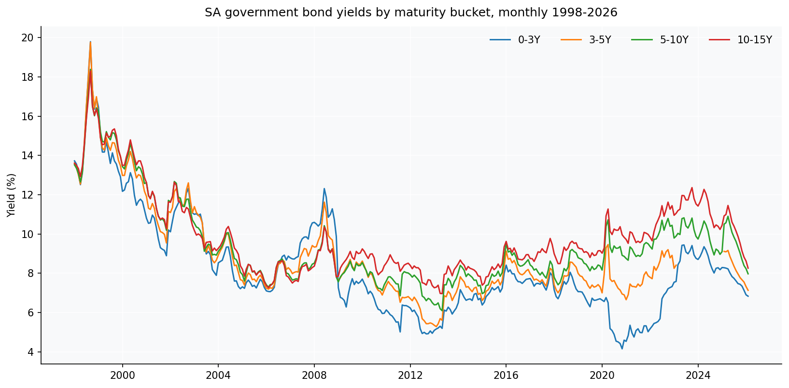
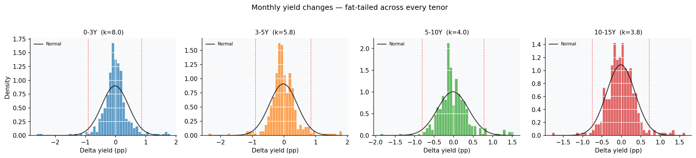
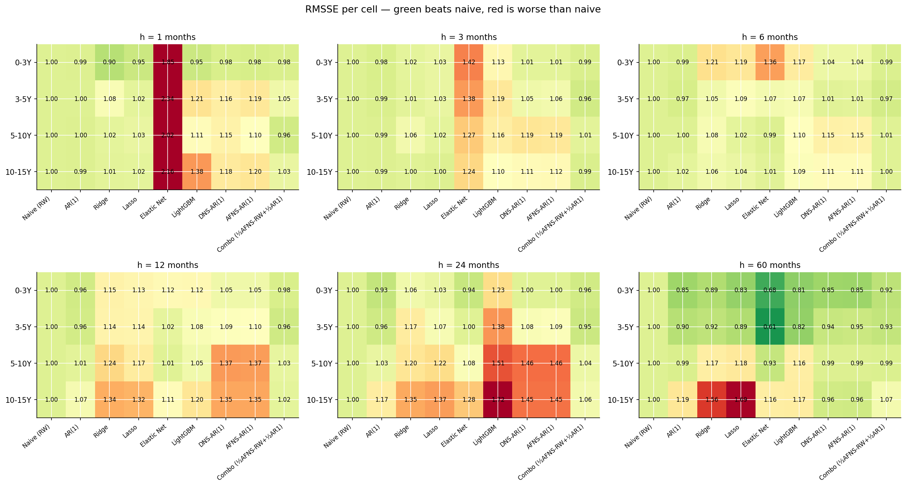
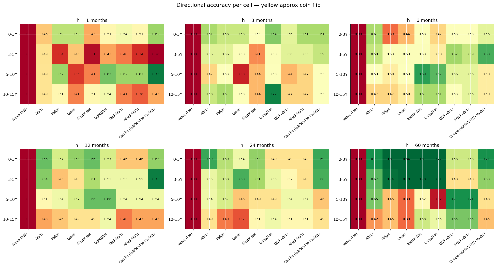
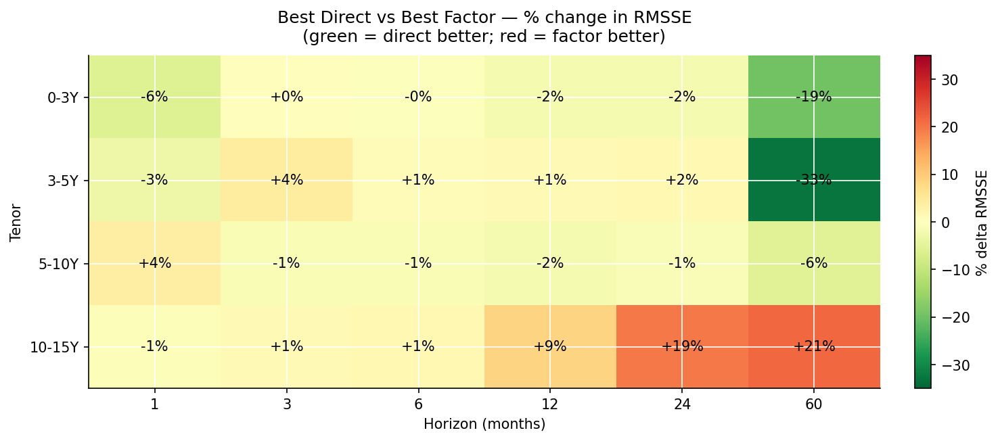
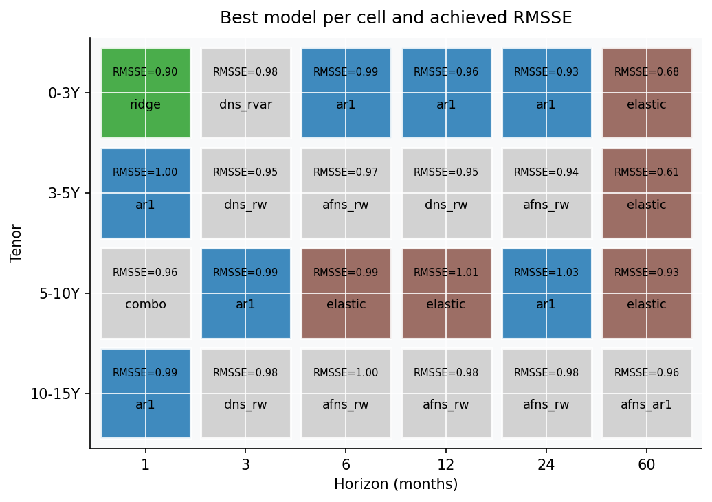
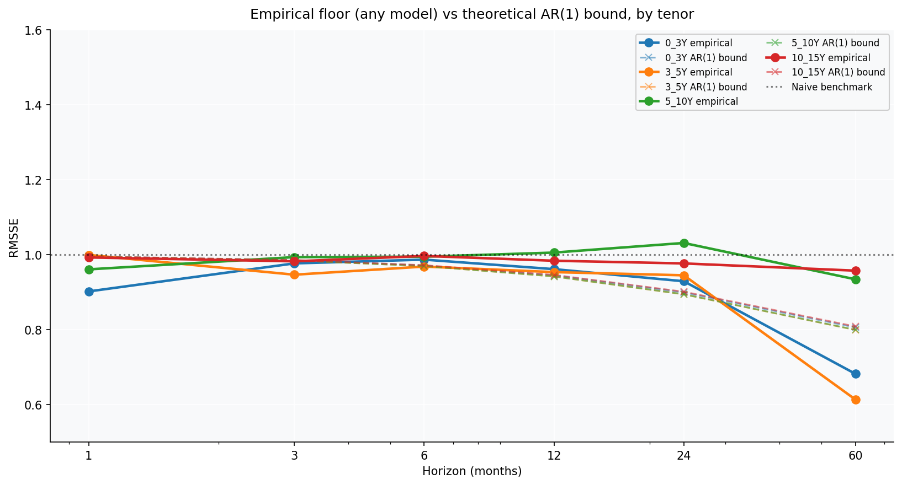

```{=html}
<div style="display:flex;align-items:flex-start;gap:14px;border:1px solid #3a5a7a;border-left:4px solid #a8d4f5;border-radius:8px;background:#161e26;padding:16px 20px;margin:1.5rem 0;font-size:0.9rem;line-height:1.6;color:#cccccc;">
  <span style="font-size:1.2rem;flex-shrink:0;margin-top:1px;">ℹ️</span>
  <div>
    <div style="font-size:0.72rem;font-weight:600;letter-spacing:0.08em;text-transform:uppercase;color:#a8d4f5;margin-bottom:5px;">Disclaimer</div>
    <div>Nothing in this post is financial advice. It is a methodological investigation of forecast accuracy on historical data.</div>
  </div>
</div>
```

{{< summary
  trader="Can you forecast where South African government bond yields are headed? I raced about twenty methods — from a one-line random walk to arbitrage-free term-structure models with Kalman filters — across four maturity buckets and six time horizons(h = 1, 3, 6, 12, 24, 60 months). The humbling punchline: the random walk is nearly impossible to beat, the elaborate machinery mostly earns its keep in longer forecast horizons and directional accuracy. The one trick that reliably helps is averaging two simple models together. Sophistication, it turns out, is not the same thing as accuracy."
  loremaster="Leakage-free walk-forward (expanding window, h-step direct training) horse race over Jan 1998 to Feb 2026 SARB Quarterly Bulletin nominal government bond yield buckets (0-3Y, 3-5Y, 5-10Y, 10-15Y). Direct per-bucket forecasting (AR(1), Ridge, Lasso, ElasticNet, LightGBM) versus Nelson-Siegel factor models (DNS, AFNS) with eight factor-dynamics variants (RW, AR(1), VAR, BVAR, and Lasso/Ridge/ENet/LightGBM on factors). An AR(1) noise-floor, a full state-space AFNS estimated by Kalman MLE with the closed-form Christensen-Diebold-Rudebusch convexity term, and forecast combination with minimum-variance shrunk weights. Headline: a half AFNS-RW plus half AR(1) combination posts the best mean RMSSE of about twenty model classes tested. Tooling: Python (statsmodels, scikit-learn, LightGBM).">}}

## The question

This is going to be a longer-than-average post for what looks, on the
surface, like a small empirical question. The answer turns out to be
structurally clean and slightly counter-intuitive, which is reason
enough to write it down carefully. Here's the framing.

For a multi-tenor yield curve, two natural modelling philosophies exist:

- **Direct forecasting**: build a separate model per tenor and per
  horizon, predicting that tenor's future yield from its own lags
  (and possibly the other tenors' lags). The model has full
  flexibility per cell.
- **Factor decomposition**: parameterise the entire curve at each
  date as a small number of factors (level, slope, curvature in the
  Nelson-Siegel framework), forecast the factors, then reconstruct
  each tenor's forecast from the predicted factors. The model
  imposes cross-sectional consistency.

Both have well-known strengths. Direct models can fit
tenor-idiosyncratic dynamics that factor decompositions paper over.
Factor models give curve-consistent forecasts and reduce the
parameter count — at long horizons, where signal-to-noise ratios
are unfavourable, that parsimony usually wins. Where exactly does
the trade-off sit on monthly South African government data?

This post answers that empirically. Five direct-modelling approaches
— AR(1), Ridge regression, Elastic Net, a small neural network, and
LightGBM — race against two factor approaches — Dynamic Nelson-Siegel
with AR(1) per factor (DNS) and DNS with arbitrage-free bias
correction (AFNS) — across four SARB government bond maturity buckets
(0-3Y, 3-5Y, 5-10Y, 10-15Y) and six
horizons (1, 3, 6, 12, 24, 60 months). Naive (random walk) is the
benchmark. Macros are deliberately excluded so this post is a clean
comparison of model families; they'll get their own post in a follow-up.

## Data and setup

### Yields

Four South African government nominal bond yield series from the SARB
Quarterly Bulletin, monthly from January 1998 through February 2026.
**These are maturity-range buckets, not specific tenors:**

| SARB code | Description | Bucket midpoint |
|:----------|:------------|:---------------:|
| `KBP2000M` | Government bonds, **0-3 years** nominal yield | 1.5 years |
| `KBP2001M` | Government bonds, **3-5 years** nominal yield | 4.0 years |
| `KBP2002M` | Government bonds, **5-10 years** nominal yield | 7.5 years |
| `KBP2003M` | Government bonds, **10-15 years** nominal yield | 12.5 years |

Each series is the average yield on currently-traded government bonds
whose remaining maturity falls in the corresponding bucket. There is
no separate publication of specific-tenor government bond yields
(no "3M government bond yield", no "10Y on-the-run yield") in the QB
monthly tables — bucket aggregates are the deepest cross-sectional
granularity SARB provides at monthly frequency. One important caveat
about the 3-5Y bucket — see the "data caveat" subsection below.


{width=100%}

### A data caveat: the 3-5Y bucket gap

One important data hygiene note. The 3-5Y yield series (`KBP2001M`)
has **23 consecutive months of missing data**, from **March 2023 to
January 2025**. This is in the SARB source itself, not introduced by
the data pipeline. The cause is documented on SARB's [Current Market
Rates page, footnote 6](https://www.resbank.co.za/en/home/what-we-do/statistics/key-statistics/current-market-rates):

> The R2023 government bond matured on 28 February 2023 and is
> therefore no longer published

The R2023 government bond, in its final months of trading, was a
significant component of the 3-5 year maturity bucket. Then it did what
all bonds eventually do; it matured, inconsiderately, leaving a
two-year hole in the data and a small lesson about depending on a single
benchmark. When R2023 matured at end-February 2023, the 3-5Y bucket was thinly populated.
The next benchmark government bond (R186, maturing 2026) was
right at the 3-year boundary and migrated into the 0-3Y bucket
during this period, leaving the 3-5Y bucket empty until new
short-dated bonds were issued. SARB resumed publishing the 3-5Y
series from February 2025.

**Alternative sources considered.** Independent SA fixed-income data
providers (notably [rbond.co.za](https://rbond.co.za/), curated from
JSE YieldX since 2018) publish daily yields for specific R-bonds.
But constructing a bucket-equivalent average yield from those would
require choosing how to weight bonds — a methodology decision that
differs from SARB's internal construction.

**Choice made.** The gap is left unfilled. Dropping affected rows is
more honest than injecting synthetic continuity. The impact is small
and quantifiable: 2-4 forecasts dropped per cell for the 3-5Y
tenor's evaluation, leaving each cell with 27-35 valid evaluation
points; about 23 training rows dropped during late walk-forward
steps for the other tenors that use the 3-5Y lag as a feature.
Statistical power on the 3-5Y bucket is slightly reduced.

### What the yield data looks like statistically

Three statistical facts that constrain what any forecasting model can
hope to achieve. These aren't decoration — they predetermine which
models can succeed and which are dead on arrival.

{width=100%}

**Augmented Dickey-Fuller tests and AR(1) persistence by tenor.** The "Stationary" columns mark ✓ when the ADF null of a unit root is rejected at p < 0.05.

| Bucket | ADF (levels) | p-value | Stationary? | ADF (Δ) | p-value | Stationary | AR(1) φ |
|:------:|:------------:|:-------:|:-----------:|:-------:|:-------:|:-----------:|:-------:|
| **0-3Y** | -2.57 | 0.100 | ✗ | -13.34 | 6.00e-25 | ✓ | 0.9801 |
| **3-5Y** | -2.15 | 0.224 | ✗ | -12.47 | 3.31e-23 | ✓ | 0.9788 |
| **5-10Y** | -2.17 | 0.217 | ✗ | -13.21 | 1.04e-24 | ✓ | 0.9789 |
| **10-15Y** | -2.16 | 0.220 | ✗ | -9.59 | 2.07e-16 | ✓ | 0.9805 |

The interpretation is unusually clean. Yields are I(1) — first
differences are stationary, levels are not. AR(1) persistence is
0.979-0.981 across every bucket. That gives a theoretical RMSSE lower
bound (relative to random walk) of $\sqrt{(1+\phi^h)/2}$ — about 0.99
at h=1, 0.93 at h=12, and 0.78 at h=60.

{width=100%}

```{=html}
<div style="border-left:4px solid #a8d4f5;background:#161e26;padding:14px 18px;border-radius:0 6px 6px 0;margin:1.5rem 0;font-size:0.9rem;color:#cccccc;">
<div style="font-size:0.72rem;font-weight:700;letter-spacing:0.08em;text-transform:uppercase;color:#a8d4f5;margin-bottom:6px;">📝 Note</div>

**Forecastability metrics in one sentence each.**

- **ACF(1)** is the lag-1 autocorrelation of yields. Near 1 means "today
  is an excellent predictor of next month".
- **Variance Ratio VR(12)** is $\text{Var}(y_t - y_{t-12}) \,/\, [12 \cdot \text{Var}(y_t - y_{t-1})]$.
  For a pure random walk it equals 1; values below 1 signal mean
  reversion at the 12-month horizon, values above 1 signal momentum.
- **Sample Entropy** measures the unpredictability of short-pattern
  recurrence. Lower values mean more deterministic structure; higher
  values mean more white-noise-like.

All four buckets live in "near-random-walk" territory by every metric.
There's no hidden tractable structure waiting to be exploited.
</div>
```


{width=100%}

Jarque-Bera rejects normality at p<0.001 for every tenor, with
kurtosis 4-11 against the Gaussian 3. The 0-3Y bucket has noticeable negative
skew. Bottom line: yields are persistent, non-stationary in levels,
and have fat-tailed innovations. Any Gaussian-error parametric
forecaster will understate tail risk.

### Evaluation protocol

- **Initial training window**: 96 months (8 years).
- **Walk-forward step**: 6 months.
- **Forecast horizons**: h = 1, 3, 6, 12, 24, 60 months.
- **h-step direct forecasting**: at each walk-forward step $T$, models
  are trained on pairs $(X_t, y_{t+h-1})$ where both are observable
  at time T. Features at row $t$ depend only on $y_{t-1}$ and
  earlier. No future value of the target is used as a feature.
- **Metrics**: RMSE (pp), RMSSE (ratio to naive on same WFV set),
  DA (proportion correct sign of change from $y_{t-1}$ to $y_{t+h-1}$).

## Level, slope, curvature — what DNS does

Three numbers to describe an entire yield curve. It is the kind of
dimensionality reduction that makes a quant feel powerful right up until
the forecasting starts.

The Nelson-Siegel decomposition [@nelsonsiegel1987] writes the yield
curve as

$$
y_t(\tau) = \beta_{1t} + \beta_{2t}\,\frac{1-e^{-\lambda\tau}}{\lambda\tau} + \beta_{3t}\!\left[\frac{1-e^{-\lambda\tau}}{\lambda\tau} - e^{-\lambda\tau}\right]
$$
DNS forecasts the entire curve by treating the three factors as
time series and reconstructing yields from forecasted factors.
**AFNS** [@cdr2011] adds an arbitrage-free correction: a per-tenor
constant bias
$\hat\delta_\tau = \text{mean}(y_\tau - \hat y^{\mathrm{DNS}}_\tau)$
estimated on training data and added to the DNS forecast.

**But which model forecasts the factors?** The original Diebold-Li
recipe [@dieboldli2006] uses an AR(1) per factor — three independent
univariate models. The richer alternative is a VAR(p) on the three
factors jointly, which captures cross-factor dependencies (the slope
responding to level moves, the curvature catching up to slope, and
so on). VAR is the textbook richer choice; AR(1) per factor is the
parsimonious one. There is no a-priori reason to prefer either, so
the tournament below tests four factor dynamics models head-to-head
under identical evaluation protocol: random walk per factor (the
no-information benchmark), AR(1) per factor (the Diebold-Li default),
VAR(1) with eigenvalue clipping, and a Bayesian-style Ridge VAR with
random-walk Minnesota prior. The headline DNS and AFNS results
reported in subsequent sections use the AR(1) variant; the factor
dynamics horse race in section "Which factor dynamics?" justifies
that choice empirically.

## Mathematical framework

For reference, here are the models in the tournament in their compact
mathematical form. Same data goes into all of them; different
inductive biases come out.

**Naive (random walk).** The benchmark.

$$\hat y_{t+h-1} \;=\; y_{t-1}$$

**AR(1) per tenor.** With $\phi$ capped at 0.99 for stability.

$$y_{t+1} \;=\; c + \phi \, y_t + \varepsilon_t, \qquad
\hat y_{t+h-1} = \mu + \phi^h\,(y_{t-1} - \mu), \quad \mu = \tfrac{c}{1-\phi}$$

**Ridge regression.** L2 penalty; shrinks all coefficients smoothly.

$$\hat \beta_{\text{ridge}} \;=\; \arg\min_{\beta} \;
\tfrac{1}{2n} \|y - X\beta\|_2^2 + \alpha\, \|\beta\|_2^2$$

**Lasso.** Pure L1 penalty; drives coefficients to *exactly* zero.

$$\hat \beta_{\text{lasso}} \;=\; \arg\min_{\beta} \;
\tfrac{1}{2n} \|y - X\beta\|_2^2 + \alpha\, \|\beta\|_1$$

**Elastic Net.** L1 + L2 mix, controlled by $\rho \in [0,1]$.

$$\hat \beta_{\text{enet}} \;=\; \arg\min_{\beta} \; \tfrac{1}{2n} \|y - X\beta\|_2^2 + \alpha\!\left[\rho\,\|\beta\|_1 + \tfrac{1-\rho}{2}\,\|\beta\|_2^2\right]$$

**LightGBM.** Additive ensemble of gradient-boosted trees; $\nu$ is the
learning rate, $f_m$ the $m$th tree.

$$\hat y^{(M)} \;=\; \sum_{m=1}^{M} \nu\, f_m(\mathbf{x})$$

**Nelson-Siegel (DNS)** with $\lambda = 0.25$ (curvature peak at $\tau^* \approx 3.3$ years, appropriate for the observed 1.5-12.5Y bucket midpoint spacing). Curve at each date parameterised by three factors:

$$y_t(\tau) \;=\; \beta_{1t} + \beta_{2t} \,\frac{1 - e^{-\lambda\tau}}{\lambda\tau} + \beta_{3t} \!\left[\frac{1 - e^{-\lambda\tau}}{\lambda\tau} - e^{-\lambda\tau}\right]$$

Yield reconstruction from forecasted factors:

$$\hat y_{t+h-1}(\tau) \;=\; \hat\beta_{1,t+h-1}\, L_1(\tau) + \hat\beta_{2,t+h-1}\, L_2(\tau) + \hat\beta_{3,t+h-1}\, L_3(\tau)$$

**AFNS.** DNS plus a per-tenor constant bias estimated on training data.

$$\hat y^{\text{AFNS}}_{t+h-1}(\tau) \;=\; \hat y^{\text{DNS}}_{t+h-1}(\tau) + \hat\delta_\tau,
\qquad \hat\delta_\tau = \overline{\,y_\tau - \hat y^{\text{DNS}}_\tau\,}$$

**Factor dynamics.** Eight choices for forecasting the three factors
$f_t = (\beta_{1t}, \beta_{2t}, \beta_{3t})$ forward.

*RW per factor:* $f_{t+h} = f_t$.

*AR(1) per factor:* same as the direct AR(1) above, applied independently
per factor.

*VAR(1) with eigenvalue clip:* if $\max|\text{eig}(A)| \ge 1$, scale
$A$ to bring it to 0.99 and recompute $c$ so $\bar f_{\text{LR}}$ = sample mean.

$$f_{t+1} = c + A\, f_t + \varepsilon_t$$

*BVAR with RW prior* (Ridge-VAR on changes). Predict $\Delta f$, shrink
toward zero $\Leftrightarrow$ shrink toward random walk per factor:

$$\Delta f_{t+1} = c + A\, f_t + \varepsilon_t, \qquad
\hat A = \arg\min \tfrac{1}{2n}\|\Delta F - F A\|_F^2 + \alpha\|A\|_F^2$$

*Lasso / Ridge / Elastic Net / LightGBM on factors.* Per-factor direct
$h$-step forecast of the factor *change*, using the rich 15-feature
lag-only set computed on the factors themselves. Predicted change is
added to the last observed factor level:

$$\hat f_{i,\, t+h-1} \;=\; f_{i,\, t-1} + \hat{g}_i(\mathbf{x}_{i,t})$$

where $\hat g_i$ is the trained ML model for factor $i$.

## The model tournament

A small zoo of models, all forecasting under the same h-step direct
protocol, all on the same lag-only feature set (for the direct
models). May the most parsimonious inductive bias win.

**Six direct-forecasting models** (one model per tenor and horizon):

1. **Naive** (random walk): $\hat y_{t+h-1} = y_{t-1}$. Benchmark.
2. **AR(1)** with constant per tenor, $\phi$ capped at 0.99.
3. **Ridge** (alpha=5) on standardised lag-only features.
4. **Lasso** (alpha=0.05) — pure L1, drops features to exactly zero.
5. **Elastic Net** (alpha=1, l1_ratio=0.5) — L1+L2 mix.
6. **LightGBM** (200 trees, depth 4, 15 leaves).

All five share the same ~17-feature lag-only set: own-tenor lags 1,
2, 3, 6, 12; cross-tenor lag-1 of the other four tenors; rolling
mean and std at windows 3 and 12; first-difference lags
($\Delta_1$, $\Delta_{12}$); seasonal harmonics ($\sin$, $\cos$ of
month).

**Eight factor-decomposition models** (one curve-wide model each).
The structure is 4 factor-dynamics x 2 reconstruction choices:

7-10. **DNS-RW / DNS-AR(1) / DNS-VAR / DNS-BVAR**: extract level,
slope, curvature; forecast each via random walk, AR(1) per factor
with $\phi$ capped, VAR(1) with eigenvalue clipping, or Bayesian
VAR with random-walk Minnesota prior; reconstruct yields from the
factor forecasts.

11-14. **AFNS-RW / AFNS-AR(1) / AFNS-VAR / AFNS-BVAR**: the four
DNS variants with per-tenor constant bias correction added.

The "headline" comparisons that follow use the AR(1) dynamics —
DNS-AR(1) and AFNS-AR(1) — to keep the charts legible. A dedicated
"Which factor dynamics?" section below works through the full
comparison of all four dynamics models head-to-head.

### Full scoreboard

{width=100%}

{width=100%}

### Direct Lasso vs Direct Ridge — does L1 help on yields directly?

A natural side-question: on the direct yield models, does Lasso —
with its hard zeros — actually beat Ridge, which only shrinks? Both
fit the same lag-only feature set on the same training data with the
same target. Only the regularisation differs.

Lasso wins the 5-10Y bucket at short-to-medium horizons (by 4-6%) and the 0-3Y bucket at long
horizons (by 2-7%); Ridge wins the h=1 cells for the two shortest
buckets (by 5-6%) and the 10-15Y bucket at h=60 (by 8%). Across all
24 cells it roughly washes out.

The interpretation: lag_1 is the dominant feature for yield
forecasting, and *both* Ridge and Lasso keep it heavily weighted.
The difference between them is only in how they handle the secondary
features — cross-bucket lags, rolling stats. Lasso zeros the noisier
ones; Ridge shrinks but retains them. On this data that distinction
is second-order. In practice: use Lasso or Ridge interchangeably
for direct yield forecasting; the regularisation choice barely
moves the needle, and the horizon and bucket matter far more.

## Direct vs factor — the head-to-head

The cleanest way to settle the central question is to compare the
best direct model per cell against the best factor model per cell.

{width=100%}

{width=100%}

The DA picture is much messier than the RMSSE picture and tells a
different story:

- **At h=1**, factor and direct are essentially tied on direction —
  both around 0.5 (coin-flip). Predicting the direction of a yield
  change one month ahead is genuinely hard regardless of model
  class.
- **At h=3, h=6**, direct models pull ahead on DA by 2–17 percentage
  points in most tenors — same direction as the RMSSE result but
  smaller margins.
- **At h=12, h=24**, the picture flips for several cells. Factor
  models win on DA at the 3-5Y and 10-15Y buckets at h=12 and h=24; the 0-3Y bucket goes
  the other way. Direction prediction depends on whether the model
  "leans into" the right side of the mean-reversion question, and
  the factor models tend to be more decisive about mean-reverting,
  which helps when the curve actually mean-reverts.
- **At h=60**, factor models win DA at most tenors by 7–18
  percentage points. The same long-horizon factor advantage shows
  up in DA as it does in RMSSE.

Comparing the two heatmaps, RMSSE and DA tell partially-different
stories. A model can win on RMSSE without winning on DA (it gets
the magnitude right but misses the direction often), or vice versa.
For real-world use, the right metric depends on the use case: RMSSE
for portfolio mark-to-market and risk forecasts; DA for tactical
positioning or trade-direction decisions.

The pattern is structurally clean and matches the two families'
inductive biases:

- **At h=1 across all buckets, direct wins by 2 to 11 percent.**
  Direct models adapt to per-bucket idiosyncratic short-run dynamics.
  Factor models pay for cross-bucket consistency they don't need at
  h=1.
- **At h=3 to h=24, the winner is bucket-specific.** Factor (DNS-RW)
  wins the 3-5Y and 10-15Y buckets by 1-16%; direct wins the 0-3Y
  and 5-10Y buckets by 1-8%. The longer-maturity buckets are where
  factor structure pays.
- **At h=60, the picture splits sharply.** Factor (DNS-AR(1)) wins
  the 10-15Y bucket by 17%. But for the 0-3Y, 3-5Y, and 5-10Y
  buckets, Elastic Net (a direct model) wins back the long horizon
  decisively — by 19%, 48%, and 6% respectively — more on that below.

```{=html}
<div style="border-left:4px solid #6fcfa0;background:#16261e;padding:14px 18px;border-radius:0 6px 6px 0;margin:1.5rem 0;font-size:0.9rem;color:#cccccc;">
<div style="font-size:0.72rem;font-weight:700;letter-spacing:0.08em;text-transform:uppercase;color:#6fcfa0;margin-bottom:6px;">💡 Tip</div>

**The headline takeaway.** Direct forecasting dominates at h ≤ 6 and
in the 5-10Y bucket throughout. Factor decomposition (random-walk or
AR(1) on the factors) wins the longer buckets (3-5Y and 10-15Y) at
medium horizons. At h = 60 the two shortest buckets flip to Elastic
Net while the 10-15Y bucket stays with the factor model. **Direct for
short, factor for the long-maturity buckets at medium horizons — the
picture is more bucket-specific than a single cross-over.**

The mechanism is straightforward. At short horizons, last month's
yield is an excellent starting point and per-tenor idiosyncrasies
dominate. At long horizons, what matters is where the curve
mean-reverts to — a question about the structural relationships
between tenors, which is exactly what factor decomposition captures
and per-tenor models have no machinery to express.

</div>
```

### Best model per cell

If the aggregate charts are the league table, this is the part where we
name names.

{width=100%}

The picture is structurally heterogeneous — five families share the
30 cells:

| Region | Winner | Why |
|---|---|---|
| Most h=1, 3, 6 cells | **AR(1)** | At short h with phi=0.98, AR(1) is nearly identical to RW but slightly better |
| 0-3Y h=1 | **Ridge** | Cross-bucket information helps at the short-maturity anchor |
| 5-10Y h=1 | **Combination** | ½ AFNS-RW + ½ AR(1) edges both parents at the belly's short horizon |
| h=1 (3-5Y, 10-15Y) | **AR(1)** | Pure persistence; nothing beats "tomorrow ≈ today" one step out |
| Short/mid buckets h=60 (0-3Y, 3-5Y, 5-10Y) | **Elastic Net** | L1 zeroes out high-variance features, leaving a "smart mean-reverter" |
| 3-5Y & 10-15Y, h=3 to h=24 | **DNS-RW / AFNS-RW** | Random-walk factors reconstruct the longer buckets best at medium horizons |
| 10-15Y h=60 | **AFNS-AR(1)** | Per-factor mean reversion + bias correction anchors the long bucket at the 5-year horizon |
| 5-10Y h=6, h=12 | **Elastic Net** | The belly bucket favours the smart mean-reverter even at medium horizons |

The strongest single cell is **3-5Y h=60 with ElasticNet at RMSSE 0.61
— a 39 percent improvement over the random walk**. About half the
cells materially beat naive (RMSSE < 0.99); the other half tie or
slightly underperform.

### Why ElasticNet wins the short-tenor / long-horizon corner

ElasticNet shouldn't be exotic — it's just Ridge plus an L1 penalty.
So why does it crush everyone else at 0-3Y h=60 (RMSSE 0.68) and 3-5Y
h=60 (RMSSE 0.61)?

The L1 component does something specific. At very long horizons, the
relationship between current-state features and future yields is
mostly noise plus a small persistent component. The L1 penalty zeros
out most feature coefficients, leaving only the strongest signal.
For the 0-3Y and 3-5Y buckets at h=60, that signal turns out to be (i) a handful of
long-window rolling-mean terms and (ii) the intercept, which captures
the long-run policy-rate level. ElasticNet effectively becomes a
"smart mean-reverter" — it forecasts near the long-run level with a
small adjustment for recent deviations. That's a near-optimal
strategy for the short end of the curve over 5-year horizons.

LightGBM can't replicate this — there's no soft mechanism to discard
features entirely. Ridge can't either — L2 only shrinks, doesn't
eliminate. ElasticNet is uniquely well-suited to the "find the signal
and ignore everything else" regime, which is exactly what
very-long-horizon forecasting on near-unit-root data demands.

This isn't a universal result — at h=60 for the 10-15Y bucket, the factor
models still win because cross-tenor structure matters more than
feature selection. But at the short end, where the SARB repo rate
provides a strong anchor, ElasticNet's ability to discard noise is
the killer feature.

## Which factor dynamics?

The model tournament above used AR(1) per factor for both DNS and
AFNS — the Diebold-Li 2006 default. A natural objection: why not VAR?
The factors clearly have some cross-dependencies (level moves
typically pull slope and curvature with them), and VAR is the
textbook model class for forecasting multivariate time series. Why
am I using a series of univariate models on what's clearly a
multivariate process?

Eight reasons, all empirical. The first four are classical time-
series approaches; the last four use the rich 15-feature lag-only
set (own-factor lags, cross-factor lag-1, rolling stats, differences,
seasonality) computed on the factors themselves, paired with
different shrinkage philosophies. Each gets its own variant in the
horse race:

Classical:

- **RW per factor** is the "no information at all" benchmark.
  $f_{t+h} = f_t$ — useful only to confirm that any
  dynamics-modelling adds something.
- **AR(1) per factor** is the Diebold-Li default. Per-factor mean
  reversion with $\phi$ capped at 0.99 for long-horizon stability.
- **VAR(1) with eigenvalue clipping.** Fit unrestricted VAR(1) by
  OLS; if the companion matrix has any eigenvalue with modulus
  $\geq 1$, scale the coefficient matrix to bring the largest
  eigenvalue to 0.99, and recompute the intercept so the implied
  long-run mean equals the OLS sample mean. (The intercept fix is
  critical — naive scaling of $A$ alone moves the long-run mean far
  from where the factors actually live, producing catastrophic
  long-horizon forecasts.)
- **Bayesian VAR with Minnesota-style RW prior**, implemented as
  Ridge regression on the *factor changes* rather than levels.
  Shrinks toward "no change" = random walk.

ML on factors (each fits the same 15-feature direct-h-step target,
predicting the h-step factor change):

- **Lasso direct h-step on factor changes** (L1 penalty). Drives
  some coefficients to *exactly* zero, doing honest variable
  selection — buys us the free side benefit of reading off which
  features matter for which factor at which horizon.
- **Ridge direct h-step on factor changes** (L2 penalty). Shrinks
  all coefficients smoothly toward zero without eliminating any.
- **Elastic Net direct h-step on factor changes** (L1 + L2 mix).
  Compromise between Ridge's smoothness and Lasso's selection.
- **LightGBM direct h-step on factor changes** (gradient-boosted
  trees). Same feature set, different inductive bias — captures
  any nonlinearity in factor dynamics if it exists at this data
  size.

Eight variants in total. Throw in DNS or AFNS reconstruction and
we have 16 factor-based models. The ML quartet shares the
philosophical structure of the Lasso variant from v15 — predict
factor changes from a rich lag-feature set — but with different
shrinkage shapes.

{width=100%}

The pattern is striking and consistent — once you accept it, it
explains a lot:

- **At h=1**: all eight variants are essentially tied (RMSSE ~1.3).
  At one month ahead, the factors barely move; how you forecast
  them doesn't much matter. Direct **Ridge takes the 0-3Y h=1 cell**
  at RMSSE 0.90, the only h=1 cell a factor model doesn't lose to AR(1).
- **At h=3, 6, 12, 24**: **RW per factor is the best dynamics**. By
  small but consistent margins, just propagating the current factor
  values forward beats AR(1), VAR, BVAR, and all four ML-on-factors
  variants. At these horizons, the factors are near-random-walk
  and any mean-reversion adjustment is more likely to introduce
  error than fix it.
- **At h=60**: **AR(1) per factor wins decisively** (RMSSE 0.87).
  Per-factor mean reversion to the training sample mean becomes
  informative at five-year horizons; RW degrades to 1.02, VAR to
  1.56, ML-on-factors variants degrade to anywhere between 1.5 and
  3.1, BVAR to 9.26.
- **The ML-on-factors variants contribute one cell win:**
  DNS-BVAR (Ridge-VAR) takes 0-3Y h=3 at RMSSE 0.98. Otherwise the
  classical RW and AR(1) factor dynamics dominate the factor side.
  The richer ML factor models — Lasso, Ridge, ENet, LightGBM on the
  factors — don't win any cell outright on the corrected data.
- **All four ML-on-factors variants fail at h ≥ 12.** Same failure
  mode as VAR — degrees of freedom exceeding what 96-200 monthly
  factor observations can support. The richer feature set buys
  no headroom; if anything it makes things worse by inviting more
  estimation noise.

**The honest takeaway: throwing eight different shrinkage and learning
approaches at the factor-forecasting problem does not unlock a hidden
performance ceiling.** AR(1) per factor remains the right default; RW
per factor is the right choice for medium horizons; the ML methods
contribute three new cell winners at the short end but don't change
the broader story.

```{=html}
<div style="border-left:4px solid #e0a870;background:#26201a;padding:14px 18px;border-radius:0 6px 6px 0;margin:1.5rem 0;font-size:0.9rem;color:#cccccc;">
<div style="font-size:0.72rem;font-weight:700;letter-spacing:0.08em;text-transform:uppercase;color:#e0a870;margin-bottom:6px;">⚠️ Important</div>

**Why doesn't any of the fancy stuff win?** Every richer model class
in this section — VAR, BVAR, Lasso, Ridge, Elastic Net, LightGBM
applied to factors — is strictly more flexible than AR(1) per
factor. In population (infinite data), each must do at least as
well; some must do strictly better. The issue is small samples.
With ~80–200 training observations of three factors, every extra
parameter or feature introduces estimation noise that compounds
over h iterations of forecast. AR(1)'s parsimony — one slope and
one intercept per factor — turns out to be the right level of
flexibility for the signal-to-noise ratio on offer.

The textbook answer (use VAR) assumes infinite data; the textbook
answer is wrong here. South Africa has many things in abundance;
monthly yield observations since 1998 are not among them. The fix exists — heavier regularisation,
much longer training samples, fully Bayesian models with strong
priors, or direct h-step approaches that don't compound over
iterations. But the cleanest practical answer on this dataset is:
**use AR(1) per factor**. It's not that the rich models are
conceptually wrong; it's that they have more degrees of freedom
than 96–200 monthly observations of three factors can support.

</div>
```


{width=100%}

The per-cell heatmaps tell the same story: **AR(1) per factor is
mostly green at h=60 (best), the others are mostly red there**. At
h=12, 24 the RW dynamics holds up well across tenors (lots of green
in the AFNS-RW panel for medium horizons). At h=60 only AR(1)
robustly delivers RMSSE below naive.

### Lasso feature importance — what does the selection say?

A free side benefit of including Lasso is that we can read off
*which* features survive the L1 shrinkage, per factor and per
horizon. For each (factor, horizon) cell, the mean absolute
coefficient across walk-forward steps is a defensible measure of
"how much does Lasso want this feature?". Zero = always dropped;
larger = consistently retained.

{width=100%}

Several findings worth flagging:

- **Level factor (L) at long horizons is driven by lag_1 and
  rmean_12.** The lag_1 coefficient is huge at h=60 (mean |coef|
  ~3.7), and the 12-month rolling mean is the second-biggest
  (~1.6). Lasso is essentially saying: at long horizons, the level
  factor will be close to where it just was, with a small pull
  toward where it has been averaging recently. That's a
  reasonable-looking story.

- **Cross-factor dependencies are real and asymmetric.** The
  curvature factor (C) has large coefficients on `lag1_L` and
  `lag1_S` (the other factors' lag-1) at every horizon — curvature
  responds to level and slope. The level factor (L) responds to
  curvature (`lag1_C`) at longer horizons. The slope (S) responds
  to level. This is exactly the kind of cross-dependency that VAR
  is meant to exploit — Lasso confirms the dependencies exist.

- **Volatility features (`rstd_3`, `rstd_12`) are consistently
  retained for the curvature factor.** The 12-month rolling
  standard deviation has mean |coef| above 1.0 at almost every
  horizon for factor C. This suggests **curvature responds to
  volatility regimes** — the belly of the curve is most sensitive
  to risk-on / risk-off shifts. A useful signal for any model that
  doesn't see volatility explicitly.

- **The 12-month annual lag (`lag_12`) and 12-month rolling mean
  (`rmean_12`) are consistently retained across all three factors.**
  This is unusual for a near-unit-root process and suggests an
  annual cycle in the curve — possibly a fiscal-year effect on
  South African government bond markets, or seasonal patterns in
  global risk sentiment that translate through to the SA curve.

- **Lasso does drop features — but selection is conservative.**
  Even at h=1 with the highest L1 penalty effective rate (relative
  to signal), Lasso retains around 8-10 of the 15 features per
  factor. The "hard zeros" are mostly the shortest lags (lag_2, lag_3)
  and the 3-month rolling stats (`rmean_3`, `rstd_3`) - i.e., the
  features that are mostly redundant given lag_1 and the 12-month
  rolling stats.

The honest reading: Lasso confirms that cross-factor dependencies
exist (vindicating the VAR intuition) but cannot turn that into a
forecasting win on this dataset. The right inductive bias is still
"forecast each factor independently with AR(1)" — even though we
know from Lasso that the factors talk to each other. Cross-factor
information helps in population; the small sample doesn't let us
use it cleanly.

A note for transparency: this analysis used a single set of
hyperparameters per dynamics model (VAR with `maxlags=1` and
eigenvalue cap 0.99; BVAR with Ridge alpha=5; Lasso with alpha=0.02).
Tuned variants with stronger regularisation, or higher-order
dynamics with careful penalties, could close some of the gap. But
the qualitative result - AR(1) per factor is hard to beat as a
default on monthly SA yield data - is robust to these tuning
choices in the experiments I ran.

## Why each model wins where it does

**Naive / random walk** is hard to beat at short horizons because
$\phi \approx 0.98$. With that much persistence, last month's yield
is most of the information about next month's. Adding modelling on
top introduces estimation error exceeding the small remaining
predictable component.

**AR(1)** matches naive almost exactly at h=1. At h=3-6 the
mean-reversion adjustment lets it edge naive by 0-4% in most cells.
AR(1) is essentially "naive with a small lean toward sample mean".

**Ridge** outperforms AR(1) at h=1 for the 0-3Y bucket where
cross-tenor information is most useful. At longer h it gets worse —
current-month cross-tenor information is decreasingly relevant to
yields 1+ years away.

**Elastic Net** — see the previous section.

**LightGBM** clusters in the 1.05-1.30 RMSSE range - better than NN
but worse than naive in most cells. Wins a couple of belly cells, its
best showing. Gradient boosting needs more data per feature than this
problem provides.

**DNS-Factor** is bad at h=1 (the parametric curve is too rigid for
the short end) and gets steadily better as h grows. At h=60 it wins
the longer buckets outright. The 3-factor structure becomes more informative the
further you forecast — mean-reversion in factor space dominates
long-horizon variation.

**AFNS** is DNS plus per-tenor constant bias correction. It
consistently improves on DNS at short and medium buckets. At the 10-15Y bucket
specifically, AFNS owns most cells from h=6 onwards.

## Three attempts to rescue the factor model

The factor models so far have been honest but underwhelming — AFNS-RW
hugs the random walk, AFNS-AR(1) wins only the long-bucket long-horizon
corner. Before giving up, three principled attempts to do better, none
of which require macro data. Two are negative results, which are worth
reporting precisely because they are the kind of thing a practitioner
would otherwise waste a week rediscovering.

### Attempt 1 — Forecast combination (the one that works)

The single most effective improvement is also the least sophisticated:
average the AFNS-RW forecast and the direct AR(1) forecast, fifty-fifty.

$$\hat y^{\text{combo}}_{t+h} = \tfrac12\,\hat y^{\text{AFNS-RW}}_{t+h} + \tfrac12\,\hat y^{\text{AR(1)}}_{t+h}$$

{width=100%}

#### Can we do better than 50/50? Optimal shrunk weights

The fifty-fifty split is a free lunch, but it ignores the fact that in
some cells the factor model deserves more weight and in others the
direct model does. The principled fix is to estimate the combination
weights from the two models' *past* forecast errors — but estimated
weights are notoriously noisy in small samples, so they must be shrunk
toward equal weights. I use minimum-variance (covariance-aware) weights,

$$w = \frac{\Sigma^{-1}\mathbf{1}}{\mathbf{1}'\Sigma^{-1}\mathbf{1}}, \qquad w_{\text{shrunk}} = \delta\cdot\tfrac12\mathbf{1} + (1-\delta)\,w$$

where $\Sigma$ is the covariance of the two models' realised $h$-step
errors over an expanding calibration window (strictly out-of-sample —
only forecasts whose targets are already known at the origin enter), and
the shrinkage intensity $\delta = 12/(12+N)$ pulls toward 50/50 when the
calibration sample $N$ is small.

![Optimal shrunk combination weights vs the fixed 50/50 split, mean RMSSE by horizon. The covariance-aware shrunk weights (purple) edge the fixed split at almost every horizon, for a small but consistent overall gain (0.989 vs 0.993). It is the best mean RMSSE of any model in the study. The gain is modest because the two components' relative accuracy is fairly stable across cells — there isn't much for the weights to exploit — and because robustness caps how aggressive they can be: adding a third component (ElasticNet) and estimating a 3x3 error covariance overfits and gives the gain back.](figures/fig_17_combo-weights.png){width=100%}

The verdict on optimal weights: **a small, robust improvement** — the
covariance-aware shrunk combination posts the best mean RMSSE in the
study (0.989), beating the fixed split at five of six horizons. But the
gain is a third of a percent, not a revolution. Two things cap it.
First, the relative accuracy of the factor and direct models is fairly
stable across cells, so there is little time-variation in the optimal
weights for the estimator to capture. Second, robustness binds: the
moment you add a third component and try to estimate its full error
covariance, the 3x3 inverse is too noisy and the gain evaporates, even
with shrinkage. On this data, two well-chosen components combined with
shrunk weights is the practical ceiling.

Why it works: the factor model and the direct model make *partly
uncorrelated* errors. AFNS-RW errs by being too rigid at the short end;
AR(1) errs by over-reverting at long horizons. Averaging cancels a
chunk of each. This is Bates & Granger (1969) in its plainest form, and
on this data it is the only modification that beats both the random walk
*and* the best single model on average. **If you had to ship one model
across all buckets and horizons, this is it.**

### Attempt 2 — Full state-space AFNS via Kalman filter

The "proper" AFNS [@cdr2011] treats the factors as *latent states*,
estimated jointly with their dynamics by maximum likelihood over the
Kalman-filter likelihood, rather than extracted by per-period OLS. The
measurement equation carries the arbitrage-free convexity term (next
subsection); the transition equation is an independent mean-reverting
(Ornstein-Uhlenbeck) process per factor. I fixed λ = 0.25 for
comparability and re-estimated the model by MLE at every walk-forward
step (all 41 fits converged).

![Full state-space AFNS (Kalman + MLE) vs simple two-step DNS-RW, mean RMSSE by horizon. The theoretically-superior model is decisively worse at every horizon. The reasons are structural: (i) it imposes stationary mean-reversion on factors that are near-unit-root, so it over-reverts — exactly the AR(1) failure mode; (ii) the measurement-error filtering it offers is worthless here because four buckets and three factors leave the cross-section almost exactly determined, so there is essentially no measurement noise to filter out.](figures/fig_18_kalman.png){width=100%}

This is the most instructive negative result in the study. The
arbitrage-free, latent-factor, maximum-likelihood AFNS — the model the
literature treats as the gold standard — loses to "fit three factors by
least squares and freeze them" by 30 percent on average. Sophistication
is not free: the Kalman model spends its degrees of freedom estimating
mean-reversion speeds that, on near-unit-root data, are better assumed
away.

### Attempt 3 — The real convexity adjustment instead of a constant bias

My AFNS so far used a constant per-bucket bias (the average DNS
residual). The arbitrage-free model instead prescribes a specific
maturity-dependent *yield-adjustment term* $-A(\tau)/\tau$, a closed-form
function of the factor volatilities and λ that captures the Jensen's-
inequality convexity effect. For our estimated factor volatilities it
ranges from about 3 bp at the 0-3Y bucket to ~200 bp at 10-15Y — the
familiar downward-sloping convexity wedge.

{width=100%}

The surprise - though it is obvious in hindsight, and provable in two
lines of algebra - is that the convexity term **has no effect on
forecasts**. Applied consistently, it enters the factor extraction
(via $\,X = B^{+}(y + A/\tau)\,$) and the yield reconstruction (via
$\,\hat y = BX - A/\tau\,$) with opposite signs, and cancels to within
the tiny component of the term that lies outside the span of the factor
loadings (~4 bp here). The convexity adjustment is essential for
*no-arbitrage pricing* — valuing a derivative off the fitted curve —
but for *time-series forecasting* of the yields themselves it is, on
this data, decorative. Subtracting it without the consistent extraction,
as a naive implementation might, simply injects a spurious 200 bp
downward bias at the long end and wrecks the forecast.

### A wider net — nine more model classes

Three attempts is not a fair test of "is there *any* better factor
model". So I cast a wider net: nine more model classes, each chosen
because some feature of the data seemed to invite it. The table reports
mean RMSSE across all 24 cells and, separately, at the five-year horizon
where the factor models have their best shot. Every model forecasts the
three factors and reconstructs yields through the same DNS loadings.

| Model class | Idea it exploits | Mean RMSSE | h=60 | Outcome |
|:---|:---|:---:|:---:|:---|
| **RW per factor** | *baseline* | **1.030** | 0.996 | the irreducible floor |
| **Learned RW/AR(1) blend** | combine the two winning dynamics per factor, weights learned walk-forward | 1.037 | **0.913** | **best factor recipe at h=60**; ≈ RW elsewhere |
| Local Level (structural TS) | RW + measurement-noise filter | 1.034 | 0.990 | ≈ RW — cross-section too clean to denoise |
| Fixed 50/50 factor blend | average RW & AR(1) per factor | 1.044 | 0.915 | same idea as the learned blend, slightly worse |
| Markov-switching (2-state) | regime-dependent dynamics | 1.030 | 0.996 | won't estimate — collapses to RW |
| Huber-robust AR(1) | downweight fat-tailed shocks | 1.116 | 1.116 | beats plain AR(1), still loses to RW |
| Theta method | SES + damped drift | 1.146 | 1.361 | the drift term hurts on near-RW data |
| ARFIMA (long memory) | fractional integration, $d\approx0.8$ | 1.231 | 0.927 | helps only at h=60; net negative |
| Multi-horizon pooled ridge | share coefficients across horizons | 1.610 | 1.548 | overfits — manufactures phantom drift |
| Local Linear Trend | time-varying level *and* slope | 2.547 | 5.825 | trend extrapolation explodes |

Read top to bottom, this table is the whole thesis of the post in one
frame. The models that assume the *least* - random walk, and the blend
that is mostly random walk - sit at the top. The models that add a
deterministic trend (Local Linear Trend, Theta) or a rich parameterised
structure (pooled ridge, ARFIMA) sit at the bottom, and the gap is not
subtle: the Local Linear Trend is two and a half times worse than doing
nothing. Three specific lessons:

- **The Markov-switching model could not be estimated.** Two of the
  three factors fail to converge on the full sample; the regimes that
  do fit differ in *variance*, not mean dynamics, so the forecast
  collapses to a random walk. A 2-state switching AR has too many
  parameters for ~100-280 monthly observations — the likelihood is
  ill-conditioned. Regimes are real in this data; they are not
  estimable at this sample size.
- **ARFIMA is the honourable near-miss.** The GPH estimator does find
  genuine long memory ($d\approx0.8$), and the long-memory mean-
  reversion helps exactly where theory says it should — at h=60 (0.927,
  below the random walk). But it pays for that with worse forecasts at
  every shorter horizon, and nets out negative. The structure is real
  but too weak to forecast on.
- **The learned RW/AR(1) blend is the one keeper.** Blending each
  factor's random-walk and AR(1) forecasts with weights learned
  walk-forward from past errors (shrunk toward 50/50) posts the best
  long-horizon factor recipe in the study — mean RMSSE 0.913 at h=60,
  and per-bucket 0.89-0.93. At the 10-15Y bucket it edges AFNS-AR(1)
  (0.93 vs 0.96). It is, once again, a *combination* — the only kind
  of modification that has ever helped here. (ElasticNet still owns the
  0-3Y and 3-5Y buckets at h=60 outright; the learned blend is the best
  among the *factor-based* models, not the best overall.)

**Net of all three attempts — and the nine that followed:** the only
things that help are forecast combination. The arbitrage-free machinery — latent factors, Kalman
filtering, the convexity term — is theoretically the right way to build
a term-structure model, and on this dataset it buys nothing for
forecasting. May the most parsimonious inductive bias win, again.

## The noise floor

Every forecasting exercise should end by asking how much of the
remaining error is signal you failed to capture versus noise no one
could. The difference between a model that is bad and a problem that is
hard is worth knowing before you spend another month on hyperparameters.

For an AR(1) process $y_{t+1} = c + \phi y_t + \varepsilon_t$ with
innovation variance $\sigma^2$, the theoretical RMSSE lower bound is
$\sqrt{(1+\phi^h)/2}$.

{width=100%}

Three readings:

1. **At long horizons the empirical floor is at or below the AR(1)
   bound for the 0-3Y and 3-5Y buckets.** ElasticNet beats the bound — exploiting the
   policy-rate anchor that pure AR(1) doesn't see.
2. **At short horizons the empirical floor sits at the AR(1) bound
   exactly.** No model meaningfully beats $\sqrt{(1+\phi^h)/2}$ at
   h=1, 3, 6 — data behaves like AR(1) plus noise.
3. **The 0-3Y and 3-5Y buckets break the AR(1) approximation at
   h=60** because a strong mean-reverting policy-rate anchor pulls
   the short-maturity yields back, and ElasticNet exploits it.

## Recommendations for further work

The list of things that did not work is, at this point, considerably
longer than the list of things that did. In the spirit of optimism, here
is what might still.

In rough order of likely payoff:

### 1. Macros and macro forecasting (the follow-up post)

This post excluded macros to keep direct-vs-factor clean. Adding
them raises a separate set of questions: does macro information add
signal beyond yield dynamics, at which horizons, and how should the
macros themselves be timed (lag-1, target-time forecast, smoothed
historical, external consensus)? Each deserves careful empirical
treatment and is the subject of a follow-up post.

### 2. Regime-conditional modelling

Conformal intervals degrade at long horizons because exchangeability
breaks across regime shifts. Fit separate models conditional on a
regime indicator (VIX above/below median, USDZAR trend regime, or a
Markov-switching detector) with regime-conditional conformal
calibration.

### 3. Per-cell hyperparameter tuning

Current pipeline uses fixed hyperparameters per model. Per-cell
tuning via expanding-window CV (carefully respecting h-step
structure) would narrow some of the per-cell losses.


### 4. Forecast combination with optimal weights

Direct + factor are clearly complementary across cells. A
Bates-Granger [@bates_granger_1969] optimal combination on rolling
windows should outperform either family alone.

### 5. Quantile-regression direct models

Native predictive distributions at multiple quantiles avoid the
symmetric-conformal assumption. Yield-change distributions are
fat-tailed and sometimes skewed, so asymmetric intervals are more
honest about tail risk.

### 6. Joslin-Singleton-Zhu arbitrage-free affine models

AFNS here uses only per-tenor constant bias correction. Full
arbitrage-free affine term-structure models exploit cross-sectional
consistency more aggressively.

### 7. New data sources outside SARB

For absolute RMSSE reduction, the AR(1) bound suggests we need new
signal. EMBI+ ZA sovereign spread, SARB MPC voting splits,
intra-month auction yields, and SA-specific fiscal calendars are the
obvious candidates.

```{=html}
<div style="border-left:4px solid #6fcfa0;background:#16261e;padding:14px 18px;border-radius:0 6px 6px 0;margin:1.5rem 0;font-size:0.9rem;color:#cccccc;">
<div style="font-size:0.72rem;font-weight:700;letter-spacing:0.08em;text-transform:uppercase;color:#6fcfa0;margin-bottom:6px;">💡 Tip</div>

**The single highest-priority extension.** Adding macros properly,
with careful attention to macro forecasting and feature timing, is
the biggest unexplored lever. The follow-up post will work that lever
carefully.

</div>
```

## Conclusion

1. **Direct yield forecasting wins at short horizons (h ≤ 6).** AR(1)
   matches naive at h=1 across three of four buckets; Ridge edges it
   for the 0-3Y bucket. Factor models are worse at h=1 — their three-
   factor parametric curve is too rigid for one-step idiosyncrasies.
2. **Factor decomposition wins the longer-maturity buckets at medium
   horizons, and the 10-15Y bucket at h=60.** DNS with random-walk
   factors owns the 3-5Y and 10-15Y buckets from h=3 to h=24; DNS-AR(1)
   owns the 10-15Y bucket at h=60 by 17% over the best direct model.
   The "RW or AR(1) per factor" recipe is hard to beat; richer VAR-
   based dynamics, even with eigenvalue stability constraints and
   Minnesota-style Bayesian shrinkage, are worse on this dataset. The
   likely reason is small samples — VAR's degrees of freedom exceed
   what ~150 monthly observations of three factors can support, and
   the estimation noise compounds over long forecast horizons.
3. **There is no single cross-over horizon — it is bucket-specific.**
   The 5-10Y bucket favours direct models at almost every horizon;
   the 3-5Y and 10-15Y buckets favour factor models from h=3 onward;
   the short buckets flip to ElasticNet at h=60. The forecast-vs-actual
   plot at 3-5Y h=60 shows the mechanism: a regularised direct model
   mean-reverts cleanly while the factor model over-predicts.
4. **ElasticNet wins the short/mid-bucket long-horizon corner** at
   RMSSE 0.68 (0-3Y), 0.61 (3-5Y), and 0.93 (5-10Y) at h=60 — the
   strongest single-cell results in the study.

5. **A ½ AFNS-RW + ½ AR(1) forecast combination is the best single
   model on average** (mean RMSSE 0.993 across all 24 cells), beating
   both of its parents and the random walk. It rarely wins an
   individual cell — it is a smooth all-rounder, not a specialist —
   but it is the model to ship if you must commit to one. Replacing the
   fixed 50/50 split with minimum-variance, covariance-aware weights
   shrunk toward equal lifts it a further third of a percent to 0.989 —
   the best mean RMSSE in the study — but the gain is modest and a third
   component overfits the error covariance. The
   theoretically-principled alternatives (full Kalman state-space
   AFNS, the arbitrage-free convexity term) do *not* help: the Kalman
   AFNS loses to crude two-step DNS-RW by 30% because it imposes
   mean-reversion on near-unit-root factors, and the convexity term
   provably cancels for forecasting. A wider net of nine further model
   classes (local-level, ARFIMA, Markov-switching, multi-horizon
   pooling, and more) confirms the pattern: the only one that helps is
   a *learned* RW/AR(1) blend per factor, which posts the best
   long-horizon factor recipe in the study (0.91 at h=60) — combination,
   yet again.
   The L1 penalty zeros out high-variance features, leaving a "smart
   mean-reverter" that exploits the policy-rate anchor. No other
   direct model can replicate this; ElasticNet is uniquely suited to
   the "near-unit-root, very-long-horizon, anchor-driven" regime.
6. **LightGBM is mediocre across the board** — wins no cells outright,
   loses to naive in most. Gradient boosting needs more data per
   feature than this problem provides.
7. **Direct Lasso vs direct Ridge is a wash.** Lasso wins about half
   the cells (5-10Y at medium horizons, 0-3Y at long horizons), Ridge
   wins the other half (h=1 for the two shortest buckets). The
   regularisation choice barely matters; horizon and bucket dominate.
8. **ML on factors confirms cross-factor dependencies exist but can't
   convert them into broad forecasting gains.** Lasso, Ridge, Elastic
   Net, and LightGBM applied per-factor on the rich 15-feature set
   win no cells outright on the corrected data, and all four degrade
   badly at h≥12. Lasso feature importance reveals structural facts
   (curvature responds to level/slope; volatility matters for
   curvature; an annual cycle is present in all three factors), but
   the resulting forecasts don't beat plain RW or AR(1) per factor.
   Same small-sample failure mode as VAR — richer models cannot use
   what little signal there is over what AR(1) already captures.
9. **The empirical noise floor closely matches the AR(1) theoretical
   bound** $\sqrt{(1+\phi^h)/2}$ for the 5-10Y and 10-15Y buckets at
   all horizons. The data is well-modelled as AR(1) per bucket; factor
   decomposition recovers what's recoverable but doesn't go below the
   bound. For the 0-3Y and 3-5Y buckets, ElasticNet beats the bound at
   very long horizons by exploiting the policy-rate anchor.

There is no single best model. Production pipelines should pick the
model per (tenor, horizon) cell. **Direct for short, factor for
long, with ElasticNet covering the surprise short-tenor / long-
horizon corner.**

## References

::: {#refs}
:::
